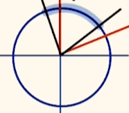

辅助角公式

其中$\varphi=arctan\frac{b}{a} \in (-\frac{\pi}{2},\frac{\pi}{2})$

> 推导：
>
> 原式=$\sqrt{a^2+b^2}{(\frac{asinx}{\sqrt{a^2+b^2}}+\frac{bcosx}{\sqrt{a^2+b^2}})}$
>
> 存在角使 $cos\varphi=\frac{a}{\sqrt{a^2+b^2}},sin\varphi=\frac{b}{\sqrt{a^2+b^2}}$
>
> 此时也易得，若a>0,b>0, $\varphi\in(0,\frac{\pi}{2})$

关注点更多放在前面的系数，用来求最值（后面的sin 最大为1）

### 恒等变换

- 特征

    

    > $\frac{\pi}{2}$，凑

- 找角关系

    

    >$\frac{\sqrt{3}}{2}$ 常见角

    

    >B；反向减

    

    > $\frac{\sqrt{3}}{3}$

- 凑

    

    > C

    

    > A

### 图像

求y 的最小值。

> $-\sqrt{3}$ 转换为圆切线斜率问题

#### 题型

$sin(\omega x+\varphi)$ 的周期变为$\frac{2\pi}{|w|}$

- 看图

    

    > $2sin(2x+\frac{\pi}{6})-1;~ 3cos(\sqrt{3}x+\frac{\pi}{6})$  

    

    >B，先特例，表示出T，然后设A 硬算。

#### 多模块交叉

放缩简略图 

> A

> CD；AB 求导算0~2pi，大概猜测；C略，D放缩

### 正余弦定理

R 为外接圆半径，进一步：$a:b:c=sinA:sinB:sinC$

#### 转换

> $\frac{\pi}{3}$；齐次直接换 

> $\frac{\pi}{3};75^\circ;4$

#### 范围、最值

> $\frac{3}{4}\sqrt{3},3\sqrt{3};2\sqrt{7}; 最小值4$  ，余弦，正弦比\辅助角，范围并结合图；或者求导
>
> 

> $4\sqrt{2}-5;不存在。。$，转为C，转为B

> $\frac{\sqrt{6}-\sqrt{2}}{4}$

> $(\frac{\sqrt{5}-1}{2},\frac{\sqrt{5}+1}{2})$ 化成基本比例值，隐藏量变和大于第三边的条件

#### 多三角形

> $\frac{3}{2}\sqrt{7},2; 自己算$

##### 没有套路

> $\frac{5}{2}\sqrt{5}$

> 2; $\frac{3}{8}\sqrt{2}$; 敏感：$\frac{BC}{sin\angle BAC}=\frac{AB}{sinC};\frac{DC}{sin\angle DAC}=\frac{AD}{sinC}$: 双余弦

