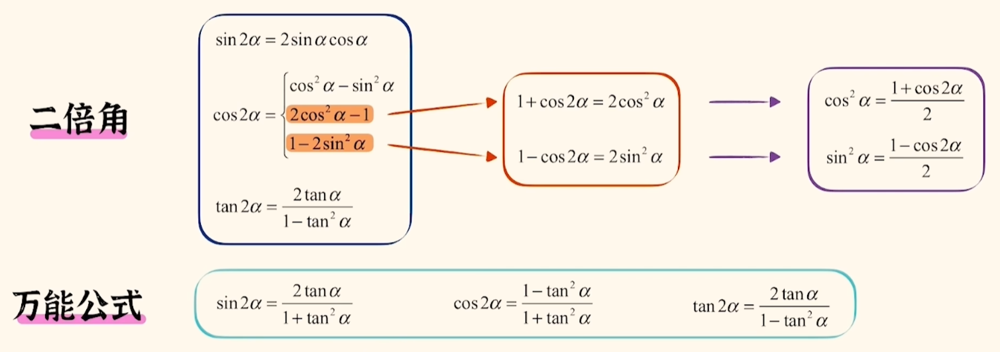

辅助角公式

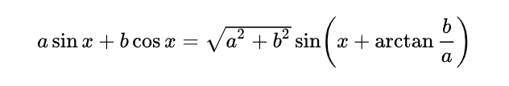

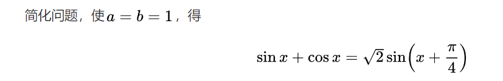

关注点更多放在前面的系数，用来求最值（后面的sin 最大为1）

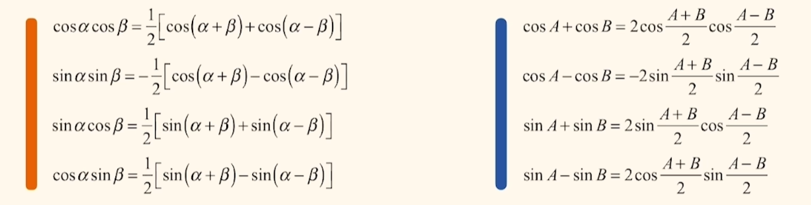

##### 恒等变换

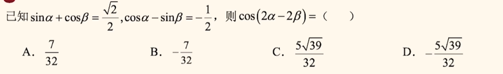

> A

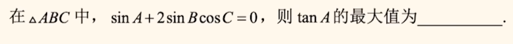

> $\frac{\sqrt{3}}{3}$

#####  特征

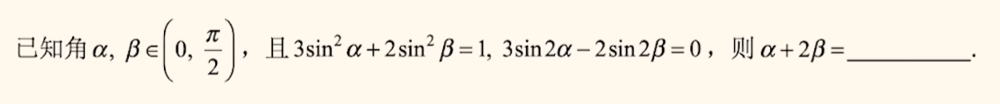

> $\frac{\pi}{2}$

##### 找角关系

 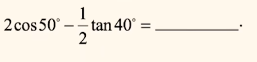

>

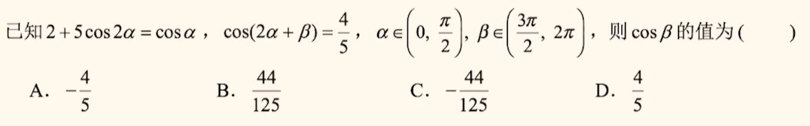

>

##### 凑齐次

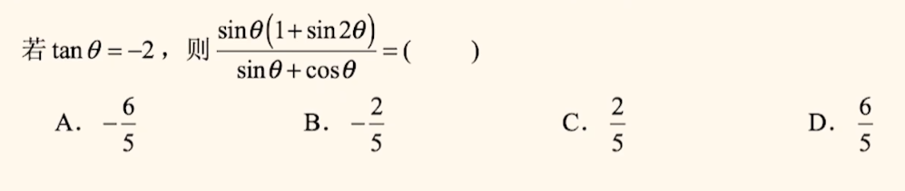

> C

#### 图像

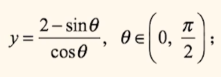

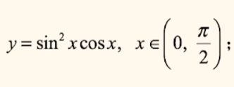

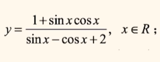

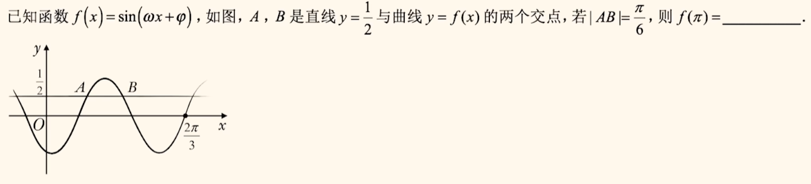

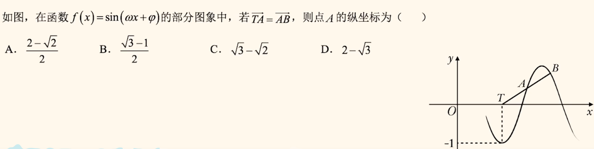

$sin(\omega x+\varphi)$ 的周期变为$\frac{2\pi}{|w|}$

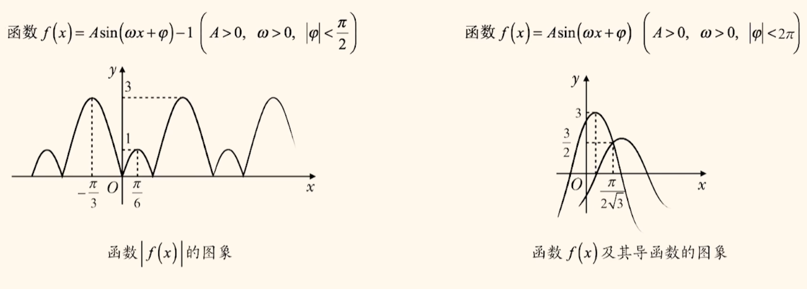

#### 多模块交叉

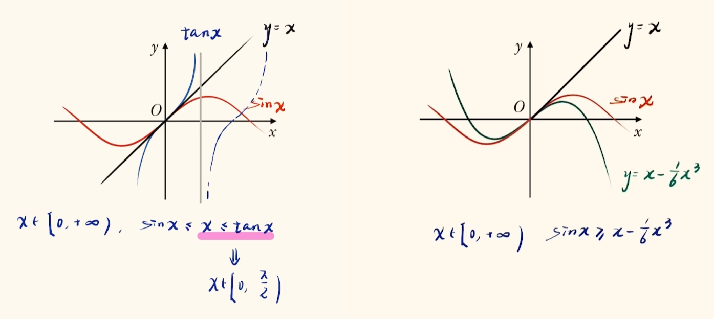

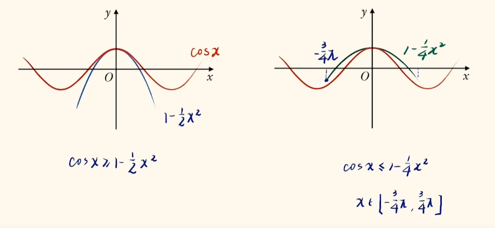

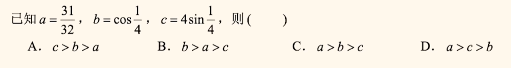

> A

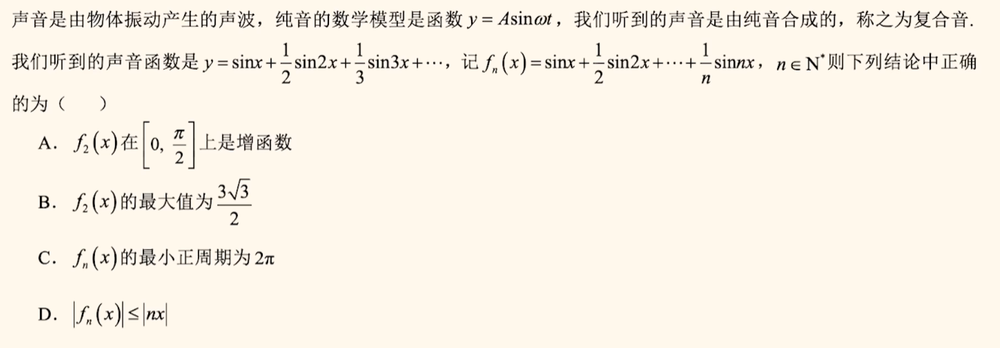

> CD

#### 正余弦定理

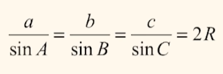

R 为外接圆半径，进一步：$a:b:c=sinA:sinB:sinC$

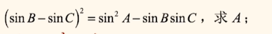

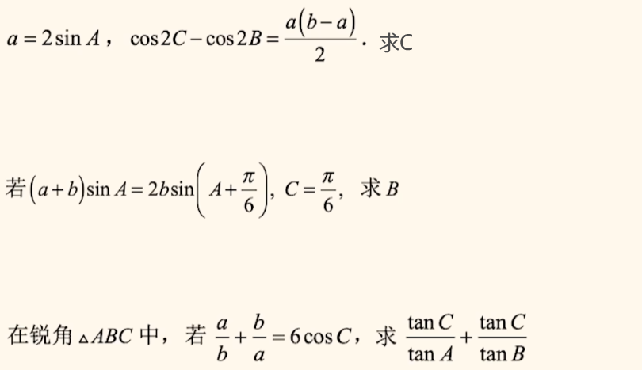

#### 范围、最值

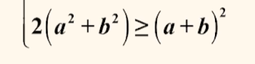

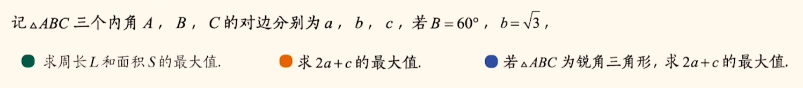

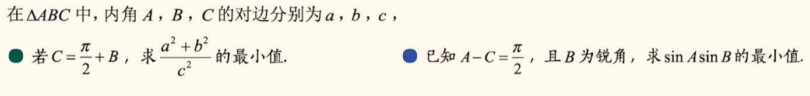

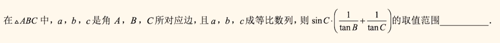

#### 多三角形

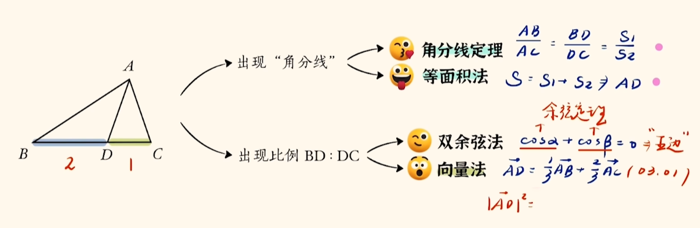

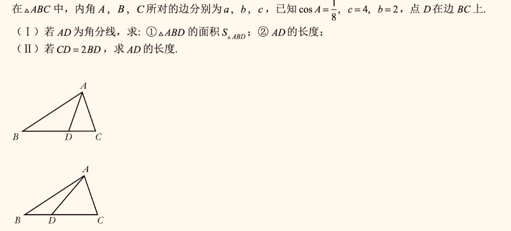

##### 没有套路

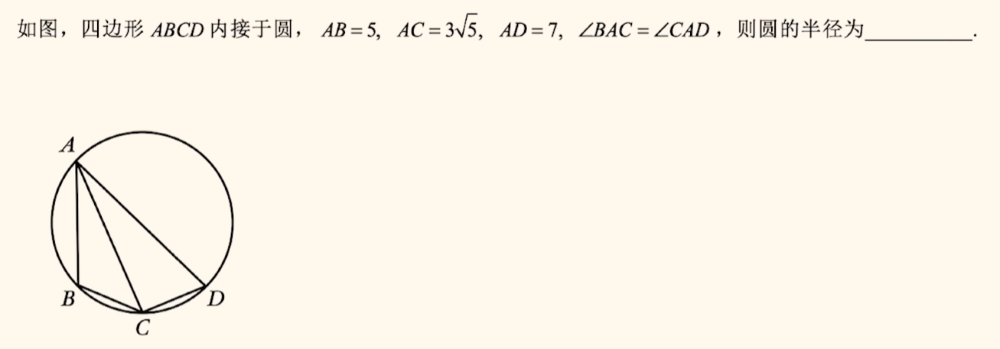

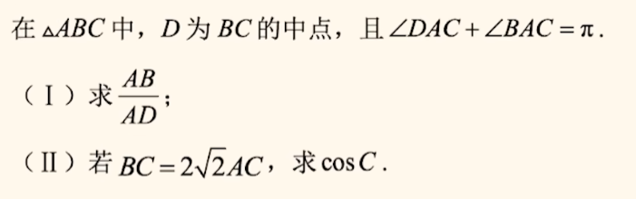

