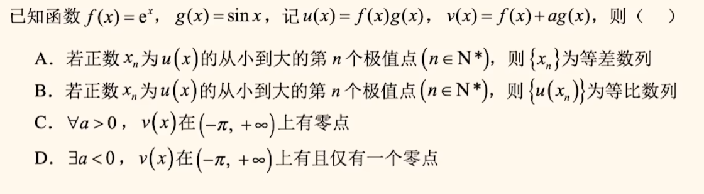

### 具体组合：

$$
奇函数:y=\frac{a^x-a^{-x}}{a^x+a^{-x}};~y=\frac{a^x-1}{a^x+1};~y=ln\frac{x+a}{x-a};~y=ln(\sqrt{x^2+1}\pm x)\\
偶函数：y=a^x+a^{-x}~~(最小值为2)\\
奇函数：y=a^x-a^{-x}
$$

先注意定义域，对称性（奇偶性），特殊值，再单调性，

> B，组合

> C，y 有正负

> x<1 or x>2；展开，奇偶，部分求导

> A；代换，求导

【综合】

> ABD；减元、换元；C 用ABD排除。。。

### 抽象条件

#### 表达式翻译：

- 周期性 

    > x 同号

    - 若$f(x+a)=f(x),则T=a$
    - 若$f(x+a)=-f(x),则T=2a$
    - 若$f(x+a)=\frac{1}{f(x)}，则T=2a$

    如$f(x)+f(x-1)=8$

- 对称性：

    > x 异号

    - 轴对称：$f(a+x)=f(b-x)$；轴为：$\frac{a+b}{2}$
    - 中心对称：$f(a+x)+f(b-x)=c$；中心为：$(\frac{a+b}{2},\frac{c}{2})$

    如$f(2-x)=-f(x+4)$

    

##### 综合翻译：

> 两个对称条件，推周期

- 若$f(x)$ 有两条对称轴 $x=a,x=b,则T=2|a-b|$
- 若$f(x)$ 有两个对称中心$(a,0),(b,0),则T=2|a-b|$
- 若$f(x)$ 有一个对称轴 $x=a$，一个对称中心$(b,0),则T=4|a-b|$

翻译一下下题 f(x) 的有效信息：

> 、对称中心（1,0）、对称轴（x=2），画图不断延伸(1,3,5 都中心且值为0；2.4.6 都轴)
>
> 、消元、对称中心（-1，-1）、对称轴反向翻译、代换（偶函数），周期为4

#### 大综合题目：

> 先求几个特殊值f(0), f(1), f(-1)

【多选】

>AC；可得解析式

【多选】

> ACD；代凑

### 题型

#### 恒成立

- 直接

    

    >$1\le k\le e^2$；分情况，求导

    

    > $0\le a\le e$

- 同构

    > 不等式里既有$e^x$，又有$ln_x$ (大概率) 
    >
    > 然后把指数对数分到等式两边 
    >
    > 再凑成 “指、幂=幂、对” 的形式

    $x=e^{ln~x}=ln~e^x\Rightarrow x\cdot e^x=e^{x+ln~x};\frac{e^x}{x}=e^{x-ln~x}$

    

    > $-3\le a\le +\infin$

    

    > $0<a\le e$ 

    

    

    >$0<a<\frac{1}{2e}$

    

    >A，乘x

#### 大小比较

- 构造 

    

    > 
    >
    > 代换，部分求导

    

    >C，凑0.1，转为函数比较。作差求导

    

    > A，凑$\frac{1}{e}$

#### 零点问题

- 分段函数

    

    > $(-\frac{2}{e},0)\cup (0,4)$；消x；

- 复合函数

    

    > D，逐步分析

#### 条件翻译

>$a\ge e^{-1}$

>$\frac{\sqrt{5}-1}{2}\le a<1$，二阶导？

> $x_1,x_2$ 附近导数异号，亦可理解为导数=0的解

> 分离，相同参数放一起；同上；敏感反推

### 多模块交叉

> ABD；A求导理解，但是要算个表达式，这样B 可以硬求比；C,D 画图猜！
