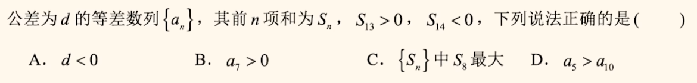
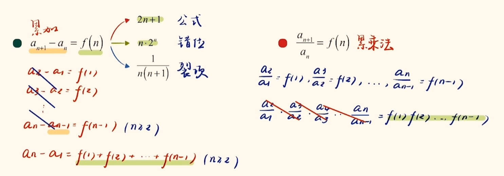

推论：

- 已知$\{a_n\}$ 为等差数列
    - 若$m+n=p+q，则a_m+a_n=a_p+a_q$
    - 前n 项和$S_n=An^2+Bn$
    - 则$S_n,S_{2n}-S_n,S_{3n}-S_{2n},...$ 也为等差数列
    - 则$\{\frac{S_n}{n}\}$ 也为等差数列
    - ${S_奇}$可以化简，$S_{2n-1}=(2n-1)a_n$
- 已知$\{a_n\}$ 为等比数列

    - 若$m+n=p+q，则a_m*a_n=a_p*a_q$
    - 则$S_n,S_{2n}-S_n,S_{3n}-S_{2n},...$ 也为等比数列
    -  前n 项和$S_n=Aq^n+B(A+B =0,q\ne1)$

> 24

> 20
>
> 等比推论

> C

> ABD
>
> 等差推论、图像

> D

### 求和

> 

### 求通项

- 递推

    

    > 不动点：设$a_n,a_{n+1}$ 都为x，得到的结果即为差值；
    >
    > 同除

- 变形

    

    > 倒数

    

    > 代换，除

- 题目提示

    

    > 除三个

- 混搭

    

### 不等式

- 裂项缩放常见

    

> 去1；
>
> 

> 糖水公式

> $3^n-1>3^n-3^{n-2}$

> 化成$n^2-\frac{1}{4} $前两项不放缩，。。怎么确定呢？先试一个处理，然后缩小差距。。

### 多模块综合

> 归纳法； 消$x_n$；切线放缩，结合（2）

