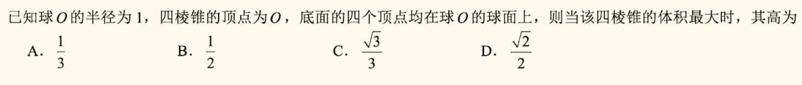

>C，独立无关联
>
>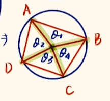

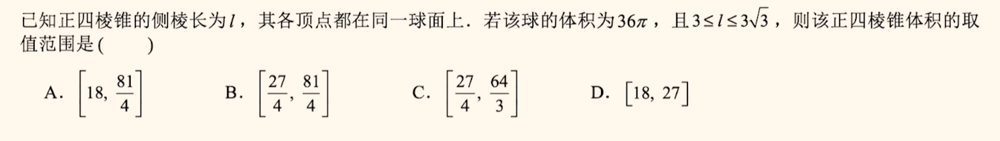

> C，画图理解

##### 抓对称

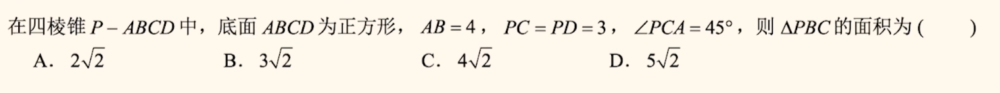

> C

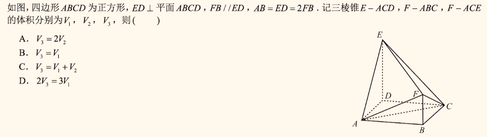

> CD；单独看EDBF 面，添加AC中点O 

##### 三棱锥转换

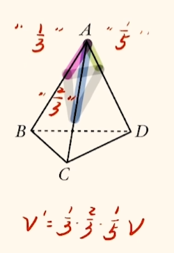

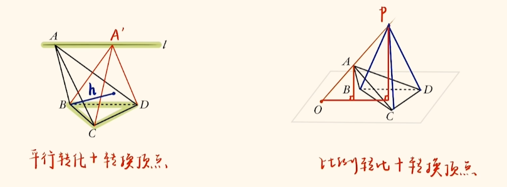

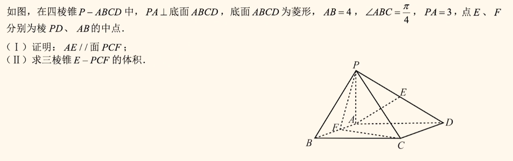

> $2\sqrt{2}$，EPCF 转为APCF

##### 平行垂直

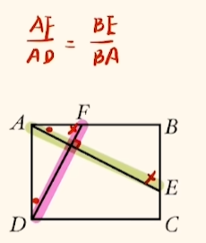

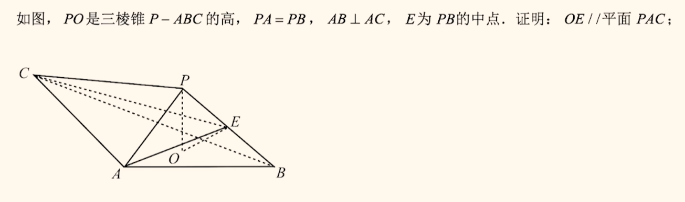

> 补AB 中点G

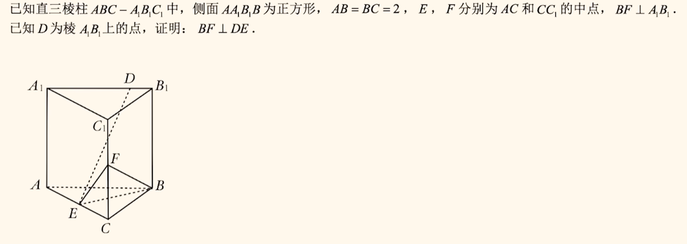

> BC 中点G；或关键找到AE 和EF 垂直；

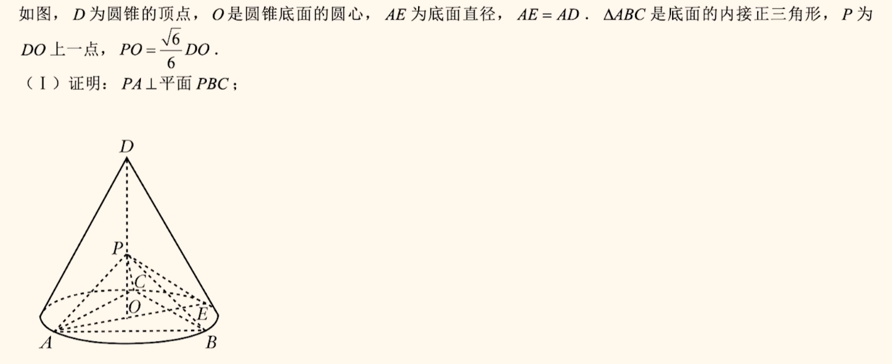

> 算

### 空间角

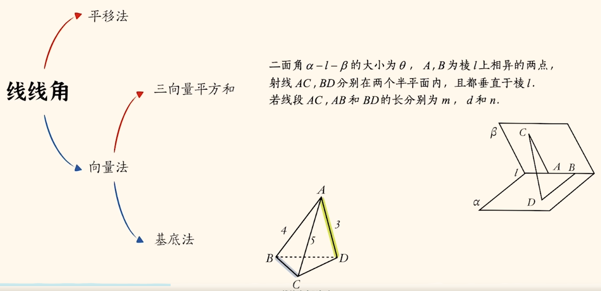

> 三向量：回环；基底：多已知角

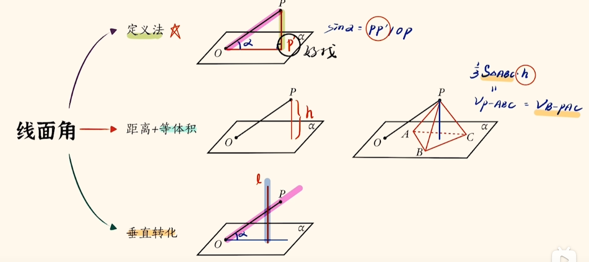

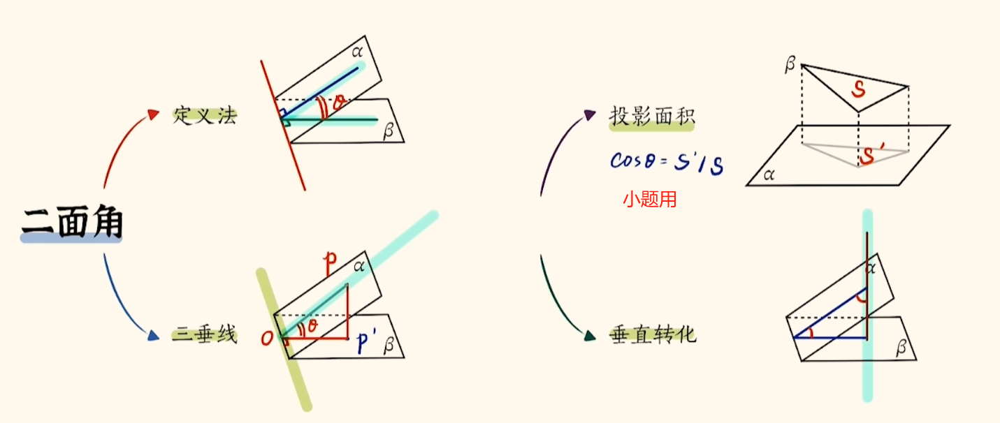

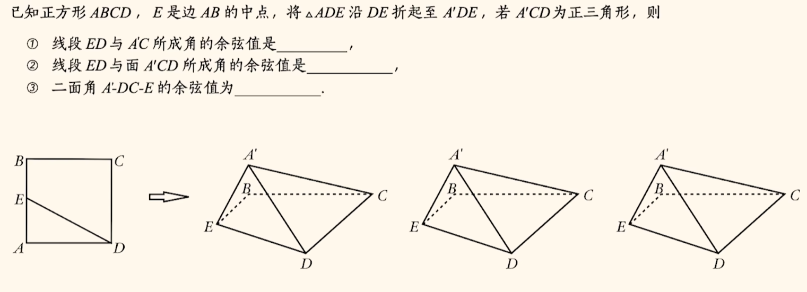

>$\frac{\sqrt{5}}{5};\frac{2}{5}\sqrt{5};\frac{\sqrt{3}}{2}$ 主要是第一个，讲一下三向量
>
>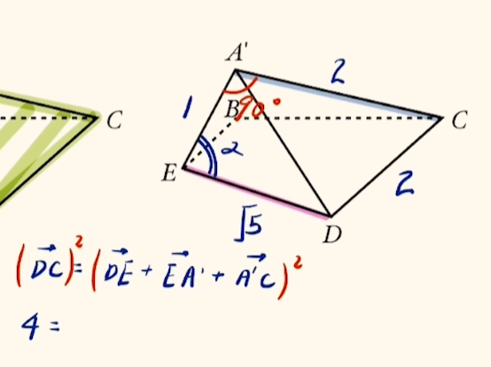

### 大题

> MN；建系，向量

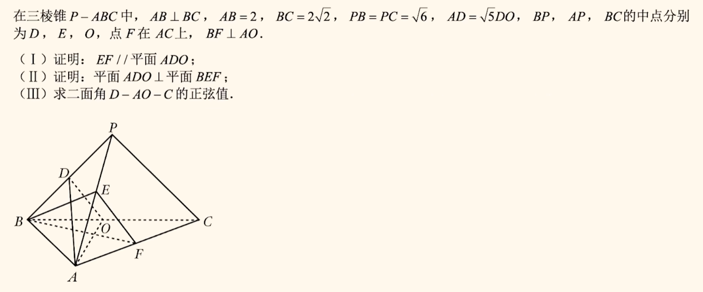

> 敏感：延长BF，交C垂线于 H ； 三向量：BDO交点。$-\frac{\sqrt{2}}{2}$

#####  球相关

内切圆：$r_切=\frac{3v}{S_表}$

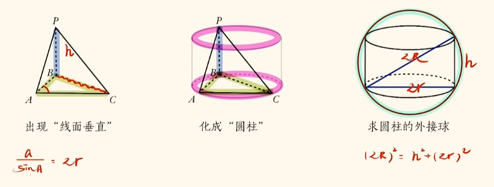

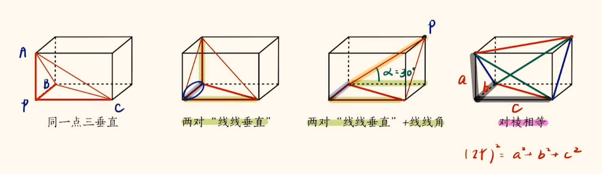

