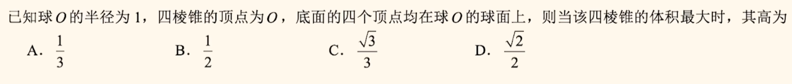

>C

> C

##### 抓对称

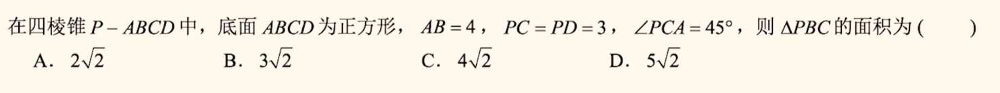

> C

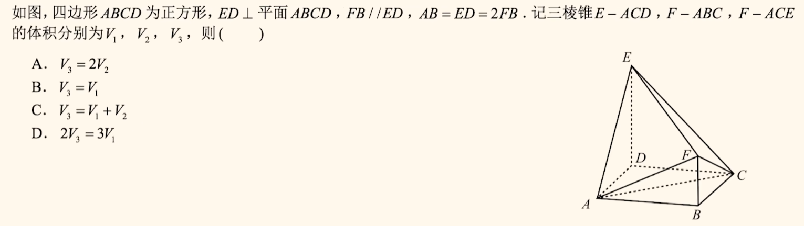

> B

##### 三棱锥转换

> $2\sqrt{2}$

##### 平行垂直

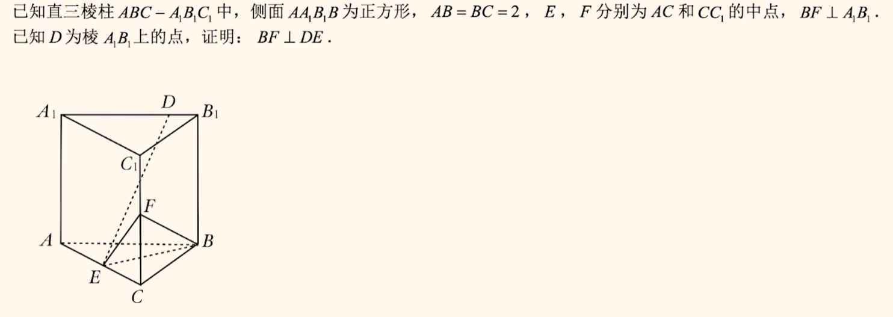

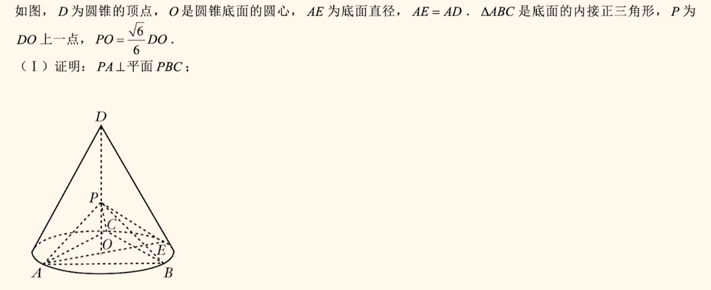

##### 空间角

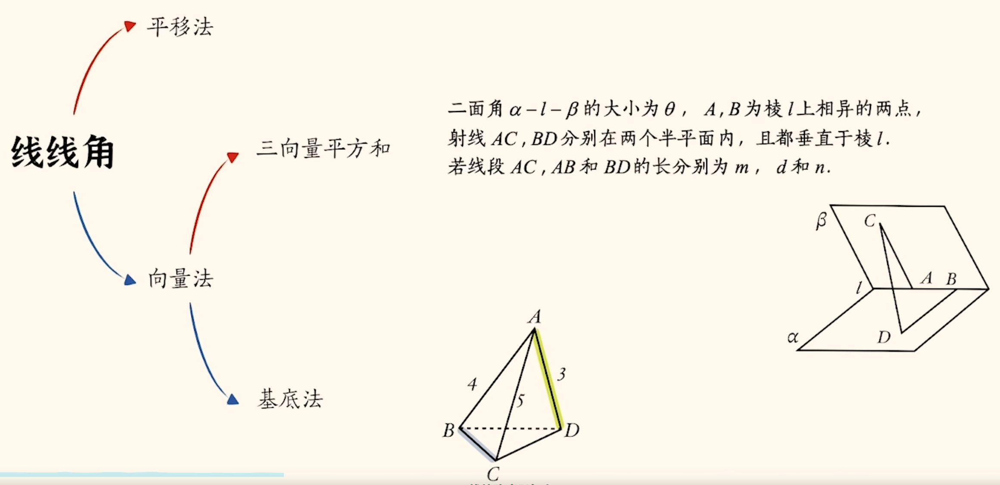

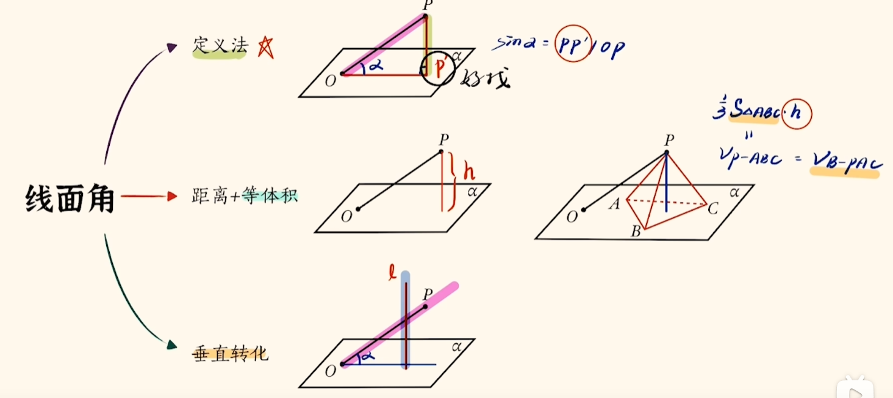

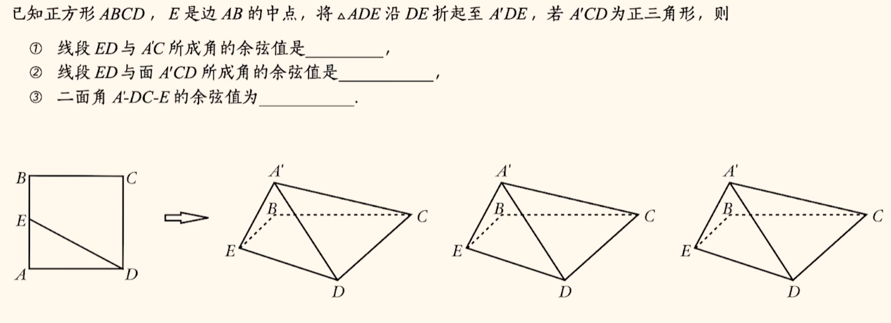

>$\frac{\sqrt{5}}{5};\frac{2}{5}\sqrt{5};\frac{\sqrt{3}}{2}$

##### 大题

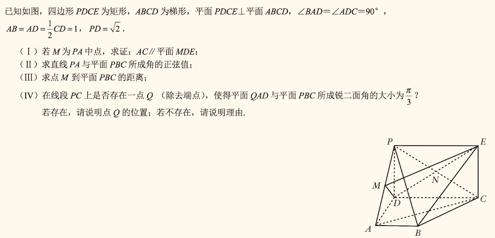

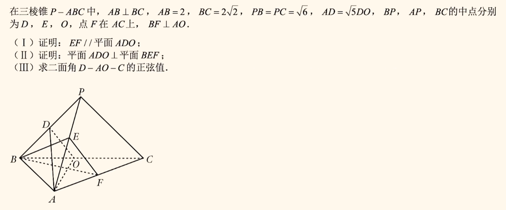

#####  球相关

内切圆：$r_切=\frac{3v}{S_表}$

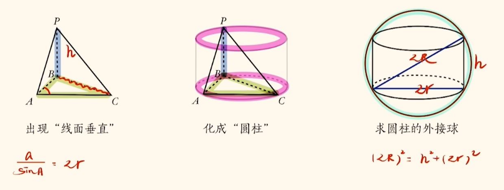

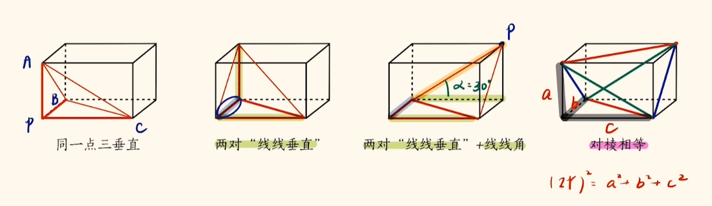

