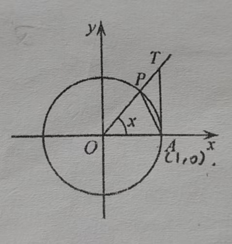

三角函数基本

$2sinx\cdot cosx=(sinx+cosx)^2-1$

- 【基本】在平面直角坐标系xOy 中，以原点O 为圆心的单位圆与锐角x 的终边交于点P，过点A(1,0) 做x 轴的垂线与锐角x 的终边交于点T，

  

  如图所示，三角形AOP 的面积 < 扇形AOP 的面积 < 三角形AOT 的面积，则

  A. $\exist x\in(0,\frac{\pi}{2}),sinx > x$    B. $\exist x\in(0,\frac{\pi}{2}),sinx>tanx$

  C. $\forall x\in(0,\frac{\pi}{2}),x+cosx>\frac{\pi}{2}$    D. $\forall x\in(0,\frac{\pi}{2}),x+tan(\frac{\pi}{2}-x)>\frac{\pi}{2}$

  > D

- 【奇偶性】已知定义域为R 的函数f(x) 满足f(1+x)+f(1-x)=0，函数$g(x)=f(x)sin\omega x(\omega>0)$，若函数y=g(x+1) 为奇函数，则$\omega$ 的值可以为

  $A. \frac{\pi}{4}\ \ \ \ B. \frac{\pi}{2}\ \ \ \ C.\pi\ \ \ \ D. \frac{3\pi}{2}$

  > BD，代入g(x+1)，代入条件

- 【奇怪的代入】已知定义在R 上的函数f(x) 满足$f(x+\frac{\pi}{2})=-f(x)，且当0<x<\frac{\pi}{2}时，f(x)=sin2x，则f(\frac{5\pi}{3})$ 的值为多少

  > $-\frac{\sqrt{3}}{2},=-f(\frac{1}{6}\pi)$

- 【辅助角公式】已知函数$f(x)=asin\omega x+bcos\omega x(a>0,b>0,\omega>0)$，在区间$[\frac{\pi}{6},\frac{\pi}{2}]$ 上单调，且$f(\frac{\pi}{6})=-f(\frac{\pi}{2})=-f(\frac{2\pi}{3})$，则不等式f(x)+a>0 的解集是：`____`

  > $(-\frac{1}{4}\pi+k\pi,\frac{5}{12}\pi+k\pi)$
  >
  > 由辅助角公式，化为$\sqrt{a^2+b^2}sin(\omega x+\varphi),\varphi=arctan\frac{b}{a}$，由条件a>0,b>0,$cos\varphi,sin\varphi$ 均大于0，得$\varphi\in(0,\frac{\pi}{2})$，
  >
  > 然后单调区间可得 $\frac{2\pi}{\omega}\div2=\frac{T}{2}\ge \frac{\pi}{3}$，
  >
  > 值相等可得：$(\frac{\pi}{6}+\frac{\pi}{2})\div 2=\frac{\pi}{3}$ 为对称中心横坐标，$(\frac{1}{2}\pi+\frac{2}{3}\pi)\div 2=\frac{7}{12}\pi$ 为对称轴横坐标
  >
  > 结合可得，$\frac{7}{12}\pi-\frac{1}{3}\pi=\frac{1}{4}\pi$ 为$\frac{1}{4}$ 周期，所以$\omega=2$
  >
  > 再代入$sin(2\cdot \frac{\pi}{3}+\varphi)=0$ 可得 $\varphi=\frac{\pi}{3}$
  >
  > 然后代回辅助角公式，易得$\frac{b}{a}=tan\frac{\pi}{3}=\sqrt{3}$
  >
  > 则所求为：$2asin(2x+\frac{\pi}{3})+a>0，即sin(2x+\frac{\pi}{3})>-\frac{1}{2}$
  >
  > $2x+\frac{\pi}{3}\in(-\frac{1}{6}\pi+2k\pi,\frac{7}{6}\pi+2k\pi)$

- 【计算】函数$f(x)=sin(\omega x+3\varphi)-2sin\varphi cos(\omega x+2\varphi)(\omega>0,0<\varphi<\pi)$，设T 为函数f(x) 的最小正周期，$f(\frac{T}{4})=\frac{1}{2}$，且函数$f(x)=(\pi,2\pi)$ 上单调，则$\omega$ 的取值范围为：

  > $[0,\frac{1}{12}]\cup[\frac{1}{8},\frac{7}{12}]$，首先化简为$sin(\omega+\varphi)$，然后根据单调性对比范围，还得注意k 为整数

  